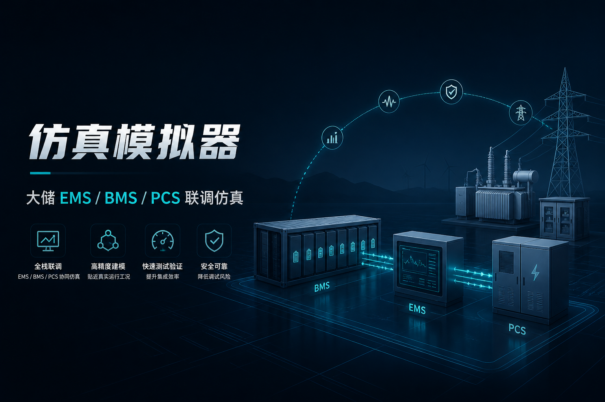
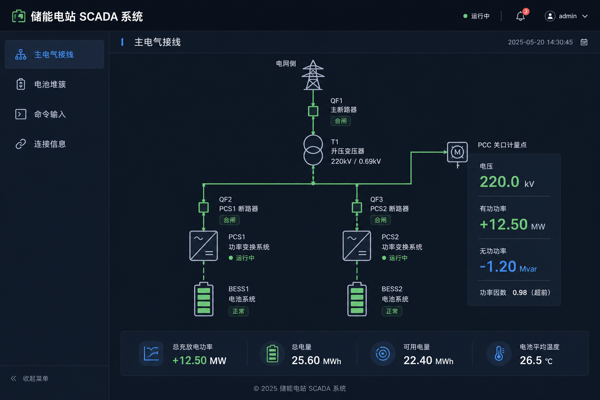
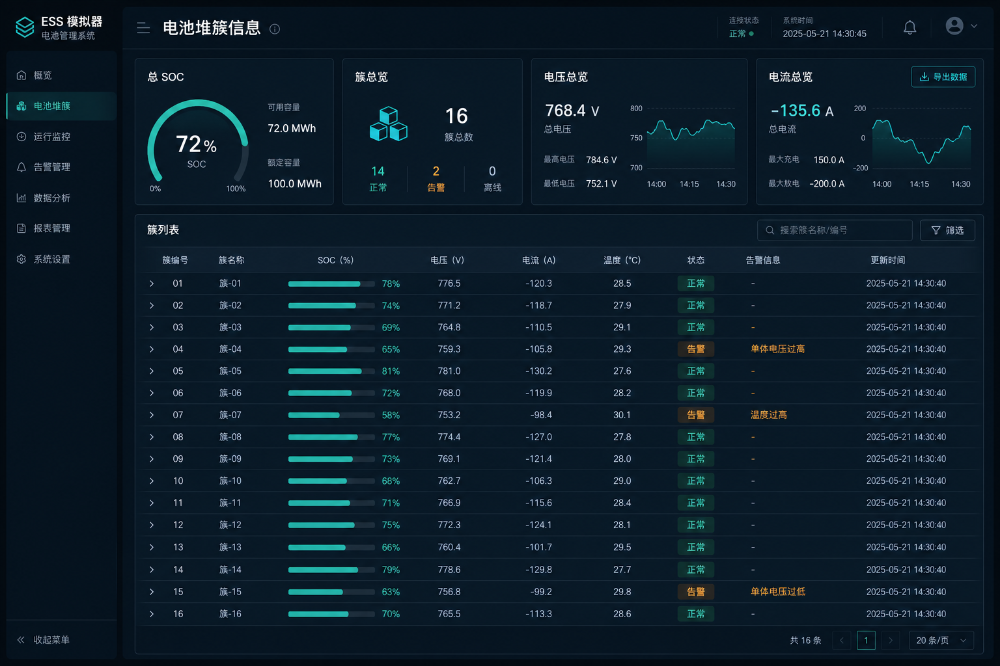

# 商业化说明 · 仿真模拟器

| 项 | 内容 |
|----|------|
| **产品名称** | 仿真模拟器 |
| **工程名（内部）** | EssSimulator |
| **定位** | 大储项目 EMS / BMS / PCS **软件仿真联调工具** |
| **当前介绍版本** | v3.0（Web 主接线能力） |
| **作者** | 宋银培（songyinpei） |
| **联系邮箱** | 624273987@qq.com |
| **文档更新日期** | 2026-07-28 |

> 下方配图便于快速理解产品形态。截图请勿包含内网 IP、客户名称、点表路径等敏感信息。

---

## 1. 它解决什么问题

在真机未到货、现场不能随意动、或需要反复验证同一工况时，用本工具在电脑上跑起一座「虚拟储能站」：

- 模拟电池、变流器（PCS）、变压器、断路器、并网点电表等行为  
- 通过 **Modbus TCP** 对外提供与现场相近的遥测与控制接口  
- EMS / 调试工具几乎可按连真设备的方式连接仿真站完成联调  

**不是**硬件在环（HIL）实时孪生，而是面向**策略与联调效率**的软件仿真。

---

## 2. 能看到什么（界面示意）

### 主电气接线总览

一眼查看断路器、主变/单元变、PCS 有功无功、电池直流侧与并网点电表等关键量，适合演示与对齐口径。

### 电池堆簇监视

从整站 SOC 到簇级状态逐级下钻，便于观察均衡与充放电过程。

### 其它能力（文字摘要）

- 命令输入与自动化脚本：改功率、分合闸、回归重放  
- 连接信息：查看 Modbus 监听与客户端是否已连上  
- 白盒切片等高级联调能力：**商业版 / 定制版**提供，社区版不含  

---

## 3. 版本与售价

产品分三档：**社区版 → 商业版 → 定制版**。  
商业版为**一次性买断**（非按小时计费）；定制版在商业版能力之上按需求加价开发。

| 版本 | 定位 | 能力边界 | 参考售价 | 获取方式 |
|------|------|----------|----------|----------|
| **社区版** | 免费体验、小站点联调入门 | 固定小拓扑（典型 **2 个储能单元**）；**不能**调整电站结构；**不含**白盒切片等高级功能 | 免费 | 联系作者获取安装包 |
| **商业版** | 正式联调与日常使用 | 对标作者当前自用的**完整开发版本**：多单元拓扑可配置、Web 主接线、命令/脚本、白盒切片等完整能力 | ¥30,000 | 一次性购买安装包与使用授权 |
| **定制版** | 按项目 / 按场景深度定制 | 在商业版基础上，按需求增加**特殊设备与功能**（见下） | 在商业版之上另计 | 需求沟通 + 交付清单 |

### 三档差异（对外口径）

| 维度 | 社区版 | 商业版 | 定制版 |
|------|--------|--------|--------|
| 电站规模 | 小站点（约 2 单元） | 完整多单元，可按项目配置 | 同商业版，并可扩展新设备 |
| 调整电站结构 | ❌ 不可调整 | ✅ 可配置拓扑与参数 | ✅ 可配置，并可定制新模型 |
| 白盒切片等高级功能 | ❌ | ✅ | ✅ |
| 特殊设备 / 行业场景 | ❌ | 标准储能站设备集 | ✅ 按需求定制 |
| 计费方式 | 免费 | **一次性费用** | 一次性 / 按定制工作量报价 |

### 定制版可以做什么（示例）

在标准储能仿真之外，可按你的场景定制，例如：

- **定制化光伏设备**：接入光伏发电模型，与储能、并网点联动联调  
- **地区历史实况复现**：按某地区历史辐照 / 发电曲线驱动光伏出力，贴近真实运行工况做策略验证  
- 其它特殊一次设备、保护逻辑、点表或协议侧扩展（以双方确认的交付清单为准）  

**说明：**

- 交付物一般为**自包含运行包**（Windows / Linux）与使用说明，**不默认交付源代码**。  
- 商业版买断后，常规版本升级策略以购买时约定为准。  
- 定制版含约定功能与联调验收范围；现场支持人天、长期维护等需合同单列。  

---

## 4. 运行环境（摘要）

| 平台 | 要求 |
|------|------|
| Windows | Windows 10/11 或 Server 2019+，x64；建议内存 ≥ 4 GB |
| Linux | 提供 ARM64 等架构发布包（以实际交付为准） |
| 依赖 | 自包含发布，**无需单独安装 .NET 运行时** |

---

## 5. 作者与联系方式

| 项 | 内容 |
|----|------|
| 作者 | 宋银培 |
| 邮箱 | 624273987@qq.com |
| 微信 / 电话 | 13486882148 |
| 公司 / 团队 | 自由团队 |
| 沟通请注明 | 用途（社区试用 / 商业买断 / 项目定制）、目标单元数、是否需要光伏等特殊设备、目标平台（Win/Linux） |

欢迎邮件或电话咨询试用包、商业版报价与定制交付范围。

---

## 6. 本公开页不包含什么

为保护实现细节与客户项目信息，本分支 / 本公开仓库：

- ❌ 不包含源代码、点表 CSV 全量、内部设计文档  
- ❌ 不包含客户现场拓扑与商业合同附件  
- ✅ 仅包含产品介绍、档位说明与界面配图  

开发与发版在**私有仓库**进行。如何安全公开本介绍页，见 [如何公开本分支.md](./如何公开本分支.md)。
